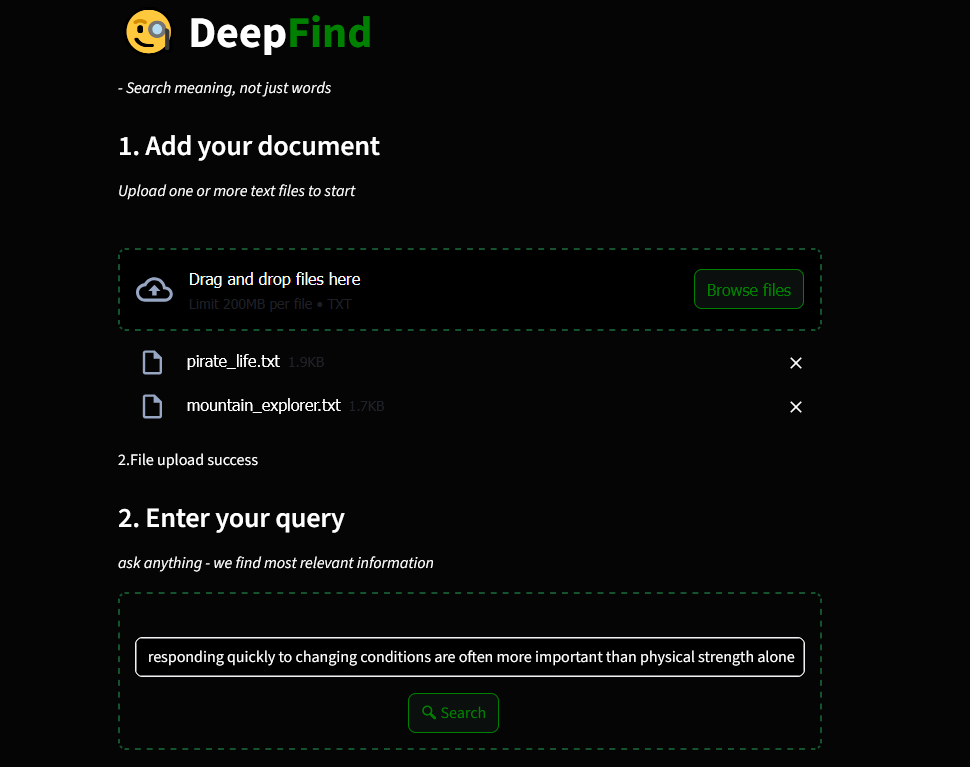
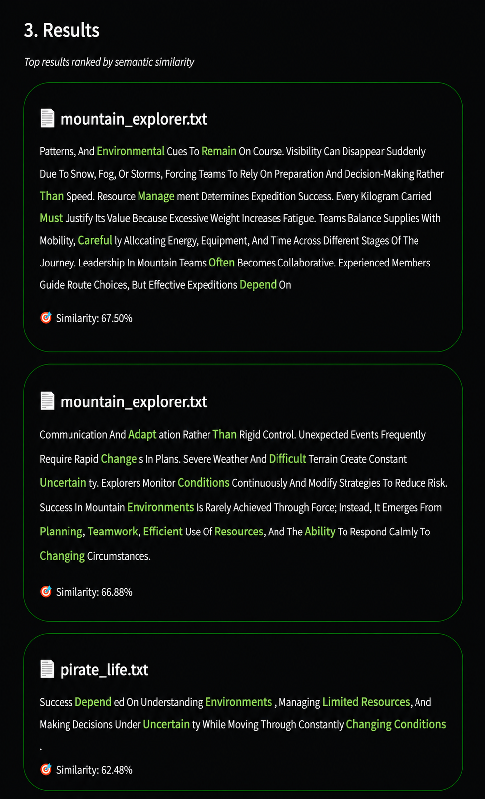

# DeepFind 🔍
### Semantic Document Search Engine

> *Search meaning, not just words.*

---

## What It Does

Most search matches exact words. DeepFind understands meaning.

Query: `"how machines learn"`
Document contains: `"gradient descent updates weights"`

Keyword search returns nothing — no words match.
DeepFind returns it — the meaning matches.

---

## Demo





---

## How It Works

```
Upload Documents
      ↓
Text split into 80-word chunks
      ↓
Each chunk encoded into a 384-dim vector (SBERT)
      ↓
Vectors saved to cache
      ↓
Query encoded into vector
      ↓
Cosine similarity — query vs every chunk
      ↓
Top 3 most relevant chunks returned
```

---

## Tech Stack

| Component | Tool |
|---|---|
| Semantic Embeddings | `sentence-transformers` — `all-MiniLM-L6-v2` |
| Similarity | Cosine similarity — implemented from scratch |
| Cache | Pickle — vectors saved, reused across queries |
| UI | Streamlit |

---

## Smart Caching

Chunk encoding happens once per file upload — not on every query.

| Situation | Action |
|---|---|
| Same files + same query | Return cached results instantly |
| Same files + new query | Reuse chunk vectors, recompute scores only |
| New files | Rebuild chunks, vectors, and scores |

---

## Project Structure

```
DeepFind/
├── app.py          # Streamlit UI
├── engine.py       # chunking, encoding, search, highlight
├── data.pk         # auto-generated cache (gitignored)
├── screenshots/
│   └── results.png
└── README.md
```

---

## Key Details

**Chunking** — 80-word chunks using `str.split()` which handles all whitespace and newlines automatically.

**Embeddings** — `all-MiniLM-L6-v2` chosen over full SBERT for 5× speed on CPU with 99% accuracy retained.

**Similarity** — cosine similarity implemented manually using NumPy. Not using library shortcuts.

**Deduplication** — files stored as a set. Duplicate uploads collapsed automatically.

---
## 🚀 Live Demo

🔗 **Live App:** https://deepfind.streamlit.app/

---

## Author

**Dola Sreecharan** — Self-taught Machine Learning Engineer

Built this project to understand backpropagation from first principles, not just use it.

- 🐙 GitHub: [sreecharan-dola](https://github.com/sreecharan-dola)
- 💼 LinkedIn: [Dola Sreecharan](https://linkedin.com/in/sreecharan-dola)
- 📧 sreecharan.dola@gmail.com

